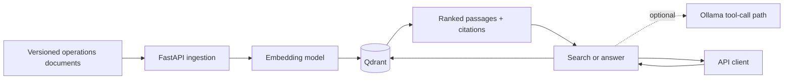

# AI Platform Reference

[](https://github.com/mrsddq/ai-platform-reference/actions/workflows/ci.yml)

A runnable reference platform for versioned document ingestion, vector retrieval, and an optional evidence-based answer path over **synthetic operations documents**. It demonstrates the engineering boundary between a retrieval service, a local LLM, and deployment infrastructure. The sample material contains no patient data and is not clinical guidance.

## What runs

- `POST /documents` validates and chunks a versioned document, records its SHA-256 digest, and stores passages in Qdrant with source, version, and passage provenance.
- `POST /search` returns ranked passages with source identifiers and citations.
- `POST /answer` retrieves first and returns an abstention when retrieval finds no passage. When Ollama is configured, it requests an answer through a source-limited tool path; retrieval works without Ollama. Generated claims still require review.
- `GET /health/live`, `GET /health/ready`, and `GET /metrics` expose liveness, dependency readiness, and service metrics.
- All `POST` routes require `X-API-Key`. The demo uses synthetic, non-patient text.



## Local quickstart

Prerequisites: Docker with Compose, and sufficient memory for Qdrant and the embedding model. Choose a private development API key and set `API_KEY` in your environment or local `.env` file. Do not commit it.

```powershell
$env:API_KEY = 'replace-with-a-long-random-development-key'
docker compose up --build --wait --wait-timeout 300
Invoke-RestMethod http://localhost:8000/health/ready
./scripts/demo.ps1
```

The first run may download `BAAI/bge-small-en-v1.5`; wait for the API health check before sending requests. Run `docker compose down` to stop the demo. `docker compose down -v` also deletes the local vector collection.

The equivalent direct application command, with Qdrant available, is:

```bash
uvicorn platform_app.api:app --host 0.0.0.0 --port 8000
```

For local code checks, install the development dependencies and run the same quick gates as CI:

```bash
python -m pip install -e ".[dev]"
python -m pytest -q
python -m ruff check .
```

Configuration: `API_KEY` is required. `QDRANT_URL`, `QDRANT_API_KEY`, `COLLECTION`, and `EMBEDDING_MODEL` configure retrieval; the default embedding model is `BAAI/bge-small-en-v1.5`. Set `OLLAMA_URL` and `OLLAMA_MODEL` only to enable local LLM answering. The Compose setup leaves Ollama off by default. See [architecture](docs/architecture.md) and [security](docs/security.md) before exposing any service beyond localhost.

## API example

```powershell
$headers = @{ 'X-API-Key' = $env:API_KEY }
$doc = @{ source_id = 'release-checklist'; version = 'v1'; text = 'A release requires a model artifact digest and an evaluation report.' } | ConvertTo-Json
Invoke-RestMethod http://localhost:8000/documents -Method Post -Headers $headers -ContentType application/json -Body $doc
$query = @{ query = 'What does a release require?'; limit = 3 } | ConvertTo-Json
Invoke-RestMethod http://localhost:8000/search -Method Post -Headers $headers -ContentType application/json -Body $query
```

The [demo script](scripts/demo.ps1) ingests all three synthetic fixtures and exercises search and answer. Run `./scripts/evaluate.ps1` afterward for repeatable hit@1 and hit@3 retrieval checks. CI also runs the three retrieval cases over the Compose HTTP stack with the real embedding model. The [evaluation guide](docs/evaluation.md) explains scope and limits; automated API tests cover the empty-collection abstention path.

## Quality gates and deployment assets

The repository includes automated tests, a CI workflow, container packaging, Helm manifests, and Terraform infrastructure configuration. Tests and local Compose validate behavior without claiming a live AWS rollout. Terraform covers an immutable ECR image repository and a versioned S3 artifact bucket; it does **not** create a VPC or EKS cluster. The application does not yet use that artifact bucket. Helm assumes an external Qdrant endpoint and separately created API-key Secret. Review credentials, network design, storage, image publishing, and a Terraform plan before use.

The operational path is in the [runbook](docs/runbook.md): image and model identity, readiness, rollout, rollback, incident triage, and backup/restore considerations. The [security guide](docs/security.md) states the controls implemented locally and the controls an organization must add before handling sensitive data.

## Scope and evidence

This is a production-oriented **reference implementation**, not a deployed medical device or validated clinical system. It uses synthetic text only. It does not establish diagnostic accuracy, patient-safety performance, regulatory compliance, fine-tuning, GPU training, hallucination prevention, or a live cloud deployment. Its value is the executable service contract, source-linked retrieval, testable failure behavior, and deployment/operations artifacts.

| Role requirement | Evidence in this repository |
| --- | --- |
| Platform API and repeatable ingestion | FastAPI contracts, Docker Compose, versioned document endpoint, tests |
| RAG and agent orchestration | Embeddings, Qdrant retrieval, citations, optional Ollama tool-call path |
| Traceability and deployment | SHA-256 provenance, Helm, ECR/S3 Terraform references, CI |
| Operations and security | Readiness, metrics, API-key gate, runbooks, explicit sensitive-data limits |
| Training, fine-tuning, GPU and clinical validation | Outside this project's implemented scope |

Related portfolio work: [EKS blueprint](https://github.com/mrsddq/aws-eks-platform-blueprint), [model-serving platform](https://github.com/mrsddq/ml-platform-infrastructure-on-kubernetes), [RAG evaluation suite](https://github.com/mrsddq/rag-evaluation-suite), and [LLM guardrails](https://github.com/mrsddq/llm-guardrails).
